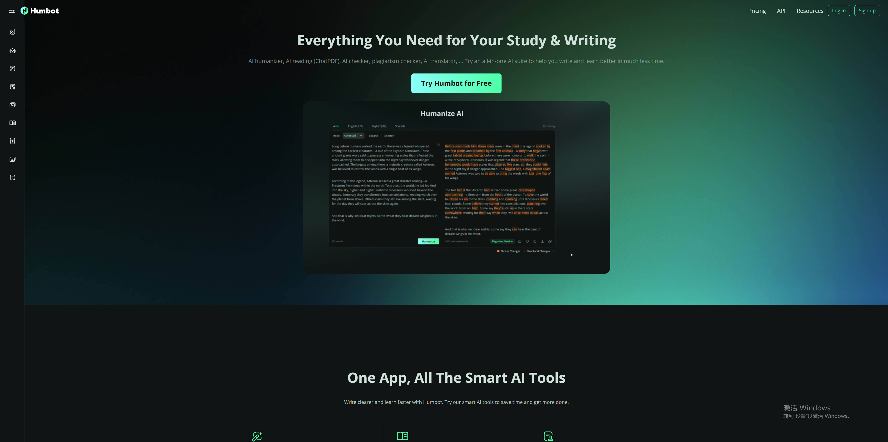
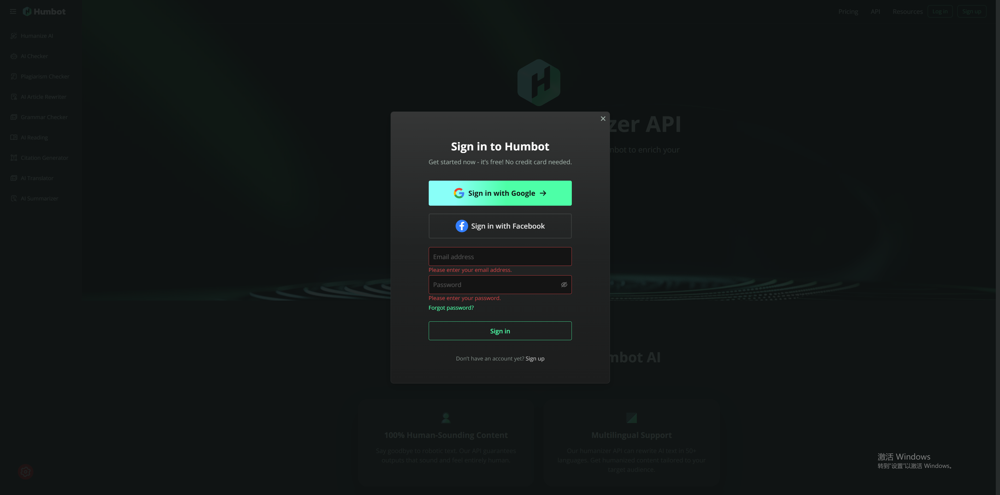
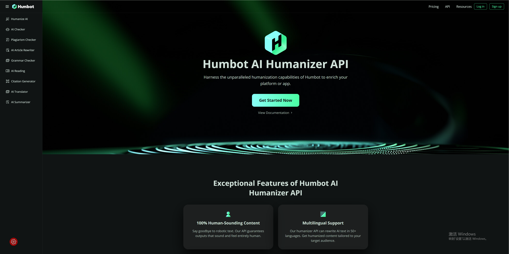
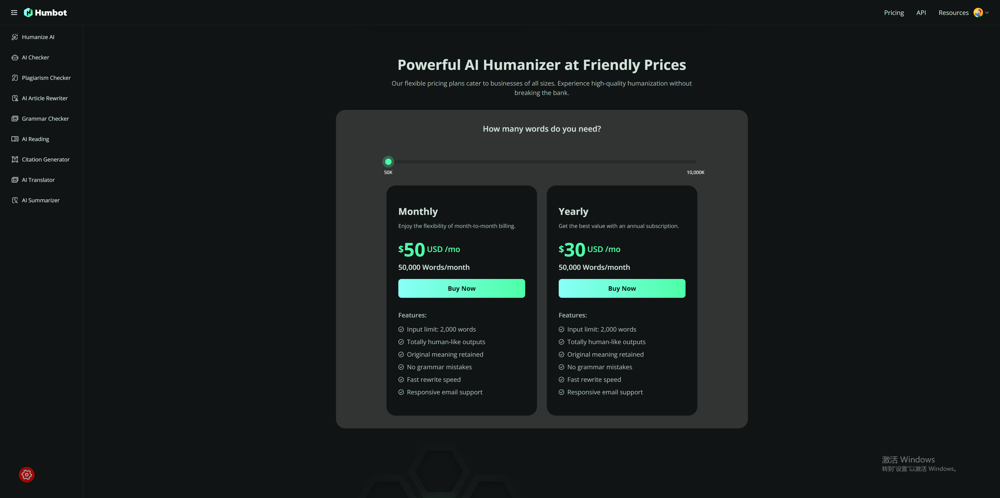
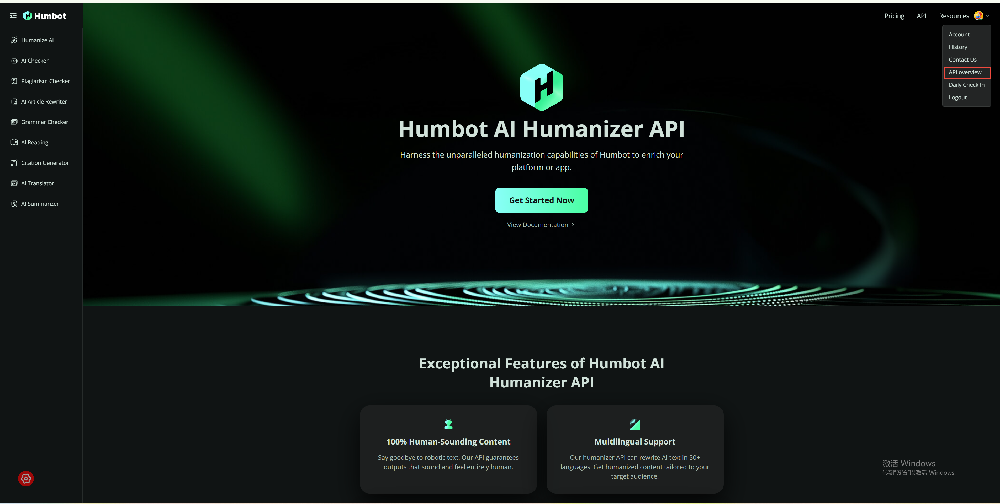
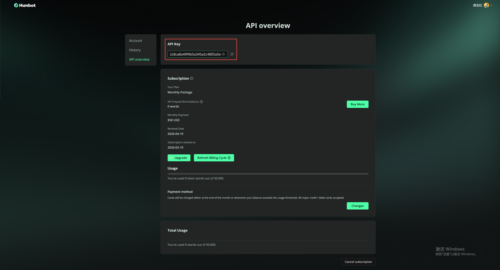

# 🎯 Humbot Humanizer 入门指南

**欢迎！** 本指南将带你了解如何开始使用 Humbot Humanizer 将 AI 生成的文本转换为更自然、更像人类写作的内容。

---

## 📋 目录

1. [什么是 Humbot Humanizer？](#什么是-humbot-humanizer)
2. [为什么需要 API Key？](#为什么需要-api-key)
3. [获取 API Key（图文教程）](#获取-api-key图文教程)
4. [配置 API Key（图文教程）](#配置-api-key图文教程)
5. [测试你的配置](#测试你的配置)
6. [使用技能](#使用技能)
7. [故障排除](#故障排除)

---

## 什么是 Humbot Humanizer？

Humbot Humanizer 是一个将 AI 生成的文本（来自 ChatGPT、Claude 等）转换为更自然、更像人类写作风格的技能。它可以帮助你：

- 去除机器人式的 AI 写作模式
- 让文本听起来更自然、更口语化
- 通过 AI 检测工具（GPTZero、Turnitin 等）
- 提升写作的真实感

**工作原理：**
你提供文本 → Humbot API 重写 → 获得自然流畅的输出

---

## 为什么需要 API Key？

Humbot API 是一个**商业服务**，需要进行身份验证。API Key 就像密码一样，用于：

- 识别你的账户
- 追踪你的使用量/配额
- 保障服务安全

**别担心！** 获取 Key 是免费的，只需约 2 分钟。

---

## 获取 API Key（图文教程）

### 步骤 1：访问 Humbot 网站

打开浏览器，访问：

👉 **https://humbot.ai**



---

### 步骤 2：登录/注册

在首页顶部导航栏，点击 **"Log In / Register"**（登录/注册）按钮。



- 如果你已有账户，输入凭据登录
- 如果你是新用户，完成注册流程

---

### 步骤 3：进入 API 页面

登录后，点击顶部导航栏的 **"API"** 链接，进入 API 订阅页面。

👉 **https://humbot.ai/ai-humanizer-api**



---

### 步骤 4：购买 API 订阅

在 API 页面，向下滚动查看 **API 订阅套餐**，选择适合你的套餐进行购买。



---

### 步骤 5：访问 API 概览

购买完成后，点击右上角**头像**打开下拉菜单，然后选择 **"API Overview"**（API 概览）。



---

### 步骤 6：复制 API Key

在 API Overview 页面，你会看到你的 API Key 显示在页面上。点击 **"Copy"**（复制）按钮将其复制到剪贴板。

```
Your API Key: sk_xxxxxxxxxxxxxxxxxxxxxxxxxxxxx
```



⚠️ **重要安全提示：**
- 🔒 像密码一样保管好这个 Key
- 🚫 不要在公开场合或截图中分享
- 🔄 如果泄露，可以重新生成新的 Key
- 💾 保存在安全的地方（如密码管理器）

---

## 配置 API Key（图文教程）

现在你需要配置技能以使用你的 API Key。

### 选项 1：永久配置（推荐）

这种方式会永久保存你的 Key，重启后无需重新输入。

#### Linux/Mac 系统：

**步骤 1：打开终端**

打开你的终端应用程序（Terminal、iTerm 等）

**步骤 2：运行导出命令**

输入以下命令（替换为你的实际 API Key）：

```bash
echo 'export HUMBOT_API_KEY="sk_your_actual_key_here"' >> ~/.bashrc
```

**步骤 3：应用更改**

运行：
```bash
source ~/.bashrc
```

#### Windows 系统（PowerShell）：

**步骤 1：打开 PowerShell**

按 `Win + X`，然后选择 **"Windows PowerShell"** 或 **"终端"**

**步骤 2：运行设置命令**

```powershell
[Environment]::SetEnvironmentVariable("HUMBOT_API_KEY", "sk_your_actual_key_here", "User")
```

**步骤 3：重启 PowerShell**

关闭并重新打开 PowerShell 以使更改生效。

---

### 选项 2：临时配置（仅当前会话）

如果你只是想快速测试：

#### Linux/Mac 系统：

```bash
export HUMBOT_API_KEY="sk_your_actual_key_here"
```

#### Windows 系统（PowerShell）：

```powershell
$env:HUMBOT_API_KEY="sk_your_actual_key_here"
```

⚠️ **注意：** 关闭终端后此配置将失效。

---

### 步骤 3：验证 Key 是否已设置

**Linux/Mac 系统：**

运行：
```bash
echo $HUMBOT_API_KEY
```

**Windows 系统（PowerShell）：**

运行：
```powershell
echo $env:HUMBOT_API_KEY
```

**预期输出：**
你应该看到你的 API Key 被打印出来（以 `sk_` 开头）

**如果为空：** 返回检查配置步骤。

---

## 测试你的配置

让我们确保一切正常工作！

### 步骤 1：进入技能目录

```bash
cd ~/.openclaw/workspace/skills/humbot-humanizer
```

### 步骤 2：运行测试

```bash
python scripts/create_task.py "This is a test sentence."
```

### 步骤 3：获取结果

```bash
python scripts/retrieve_result.py <task_id> --wait
```

🎉 **成功！** 你现在可以开始使用这个技能了。

---

## 使用技能

### 通过 OpenClaw AI 助手使用

只需自然对话即可：

**示例：**

1. **"人性化这段文本："**
   ```
   Humanize this: Artificial intelligence has fundamentally transformed...
   ```

2. **"让这段听起来更自然："**
   ```
   I wrote this with ChatGPT but it sounds too robotic...
   ```

3. **"重写这段以通过 AI 检测："**
   ```
   I need this essay to pass Turnitin...
   ```

### 手动使用（高级）

查看 `README.md` 了解详细的命令行用法。

---

## 故障排除

### ❌ "HUMBOT_API_KEY not set"（未设置 API Key）

**解决方案：** 返回 [配置 API Key](#配置-api-key图文教程) 部分，按照步骤操作。

### ❌ "Authentication failed"（认证失败）

**解决方案：**
1. 检查你的 API Key 是否正确
2. 登录 https://humbot.ai 验证账户是否活跃
3. 如有需要，重新生成 Key

### ❌ "Task takes too long"（任务耗时过长）

**这是正常的！** 处理时间：
- Quick（快速）：5-15 秒
- Standard（标准）：15-30 秒
- Advanced（高级）：30-60 秒

请耐心等待轮询完成。

---

## 📝 截图清单

要完成本教程，你需要将 **6 张 API Key 获取流程截图** 添加到 `assets/` 文件夹：

### 第 1 部分：获取 API Key（截图 1-6）
1. `screenshot-01-homepage.png` - Humbot 首页 (https://humbot.ai)
2. `screenshot-02-login-register.png` - 顶部导航栏的登录/注册按钮
3. `screenshot-03-api-nav.png` - 顶部导航栏的 API 文字按钮
4. `screenshot-04-subscription.png` - API 订阅套餐区域
5. `screenshot-05-avatar-dropdown.png` - 头像下拉菜单中的 API Overview 选项
6. `screenshot-06-apikey-copy.png` - API Overview 页面及复制按钮

---

*最后更新：2026-03-19*
